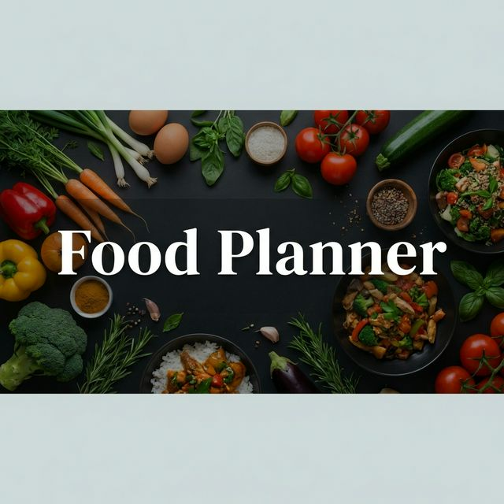
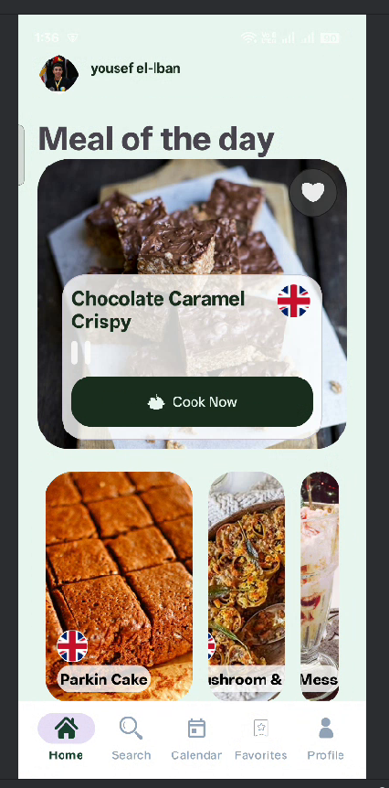
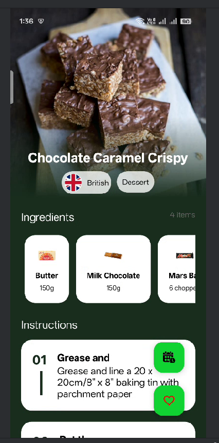
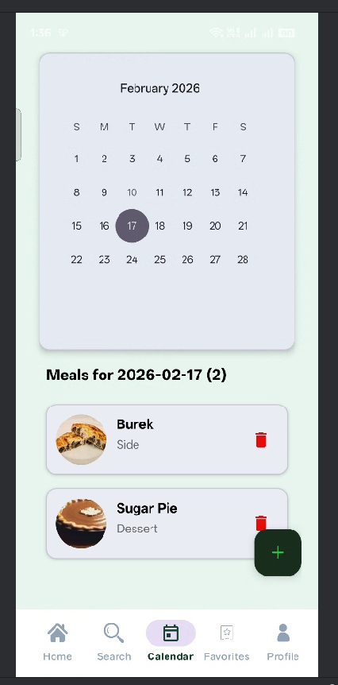
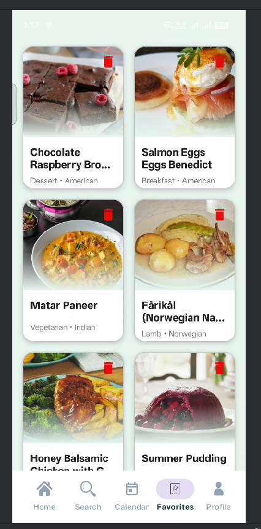

# Food Planner Application



## Overview

**Food Planner** is a comprehensive Android application designed to help users discover new recipes, manage their favorite meals, and plan their dietary schedule. Built with a focus on user experience and robust architecture, the app integrates cloud synchronization with offline capabilities to ensure a seamless experience whether you're online or on the go.

## ✨ Key Features

- **User Authentication**: Secure login and registration using Email/Password and Google Sign-In via Firebase Authentication.
- **Recipe Discovery**: Browse meals by category, area, or search for specific ingredients.
- **Meal Details**: View comprehensive recipe details including ingredients, measurements, and instructional videos.
- **📅 Meal Planning (Calendar)**: Schedule meals for specific dates using an interactive calendar. Data is synced to the cloud and cached locally.
- **❤️ Favorites**: Save your favorite recipes for quick access. Fully functional offline using Room database.
- **Offline Support**: Smart caching strategies allow users to view their schedules and favorites even without an internet connection. Includes connectivity monitoring and alerts.

## 📱 Screenshots

| Home Screen | Meal Details |
|:---:|:---:|
|  |  |
| **Dashboard & Discovery** | **Recipe Information & Actions** |

| Calendar Schedule | Favorites Collection |
|:---:|:---:|
|  |  |
| **Weekly/Monthly Planning** | **Saved Recipes (Offline)** |

## 🛠️ Architecture & Tech Stack

The application follows the **MVP (Model-View-Presenter)** architectural pattern to ensure separation of concerns and testability. It utilizes the **Repository Pattern** to manage data flow between remote sources and local cache.

### Core Technologies
- **Language**: Java
- **Minimum SDK**: 26 (Android O)
- **Target SDK**: 36

### Key Libraries
- **Networking**: [Retrofit](https://square.github.io/retrofit/) + [OkHttp](https://square.github.io/okhttp/) for API calls.
- **Reactive Programming**: [RxJava 3](https://github.com/ReactiveX/RxJava) & RxAndroid for asynchronous operations and event handling.
- **Local Database**: [Room](https://developer.android.com/training/data-storage/room) for persistent local storage and offline caching.
- **Cloud Backend**:
  - **Firebase Authentication**: User identity management.
  - **Firebase Firestore**: Cloud storage for meal schedules.
- **Image Loading**: [Glide](https://github.com/bumptech/glide) for efficient image caching and rendering.
- **UI Components**:
  - Material Design 3
  - [Lottie](https://airbnb.io/lottie/#/) for animations.
  - Navigation Component for fragment navigation.
  - [Android-YouTube-Player](https://github.com/PierfrancescoSoffritti/android-youtube-player) for embedded recipe videos.

## 🏗️ Setup & Installation

1.  **Clone the repository**:
    ```bash
    git clone https://github.com/your-username/ITI-Food-Planner-Application.git
    ```
2.  **Open in Android Studio**:
    - Open Android Studio -> File -> Open -> Select the cloned project folder.
3.  **Sync Gradle**:
    - Allow Android Studio to download dependencies.
4.  **Firebase Configuration**:
    - Place your `google-services.json` file in the `app/` directory.
5.  **Run the App**:
    - Select an emulator or physical device and click **Run**.

## 🤝 Contributing

Contributions are welcome! Please fork the repository and submit a pull request for any enhancements or bug fixes.

---
*Developed as part of the ITI Android Application Development Program.*
